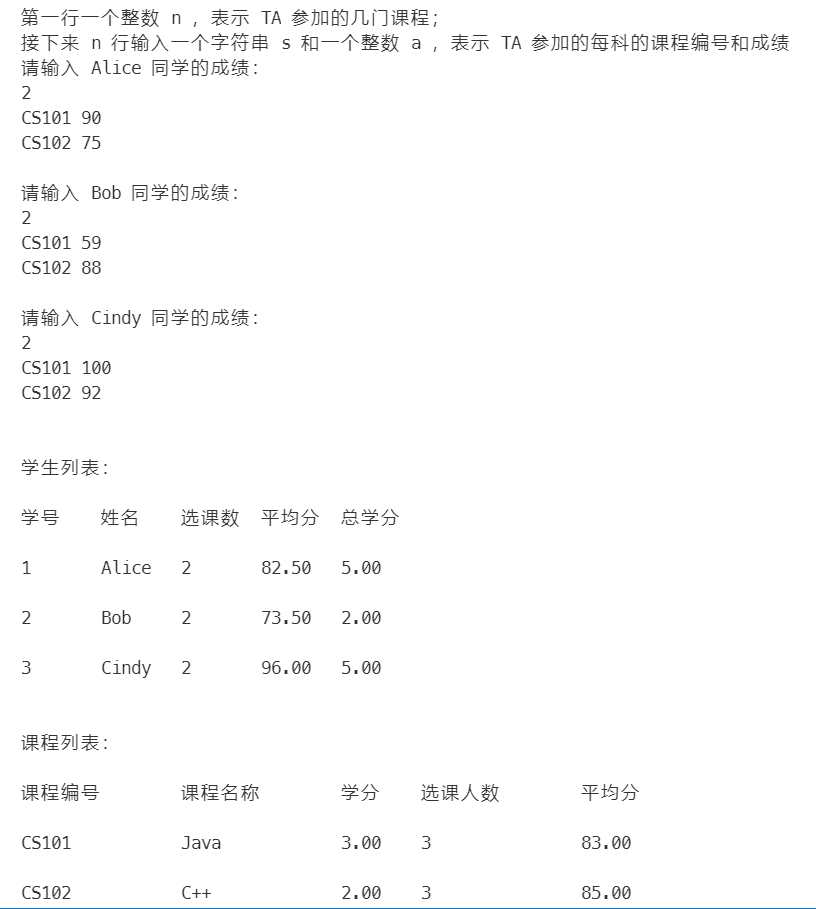

# 《基于Java EE平台的软件开发》实验报告

## 实验1：对象和类

| 学号       | 姓名   | 得分 |
| ---------- | ------ | ---- |
| 120L021403 | 冯新航 |      |

### 工程目录

```bash
├─README.md        
│  
├─docs
│    ├─testdata.in  
│    ├─实验1任务.doc
│    └─实验1报告.doc
│      
├─lib
├─output
│    ├─demo.png     
│    └─run.txt
│
└─src
    ├─App.java
    ├─Test.java
    │
    └─com
        └─vonbrank
            └─StudentScoreRecorder
                  ├─Course.java
                  ├─SelectCourse.java
                  └─Student.java
```

### 程序详细运行过程及截图：

